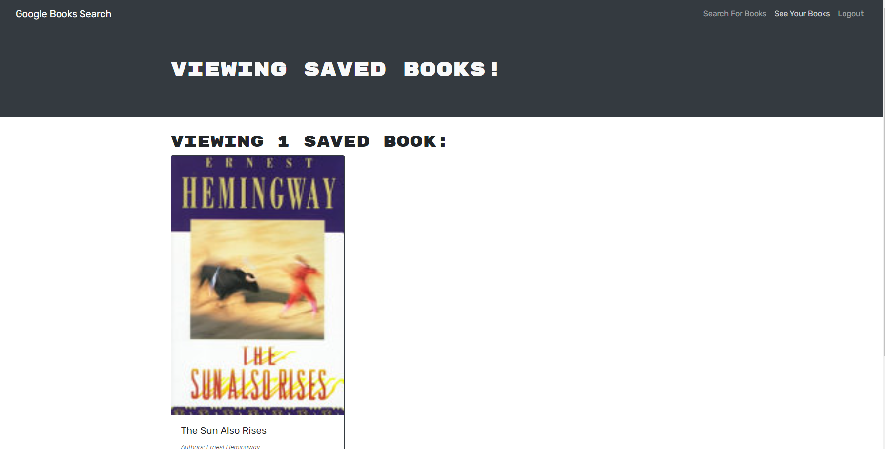

# Library Search

#### This application uses Google Book Search API in order to let users find their favorite books and add them to a save list. All queries are made using GraphQL in order to return user and saved book data. JSON web token is used as an authentication method as well.

## Deployed application:

https://glacial-woodland-09386.herokuapp.com/

## Table of Contents

- [Technologies used](#technologies-used)
- [License](#license)
- [Contributors](#contributors)
- [Questions](#questions)

## Technologies Used

- React
- Bootstrap
- GraphQl
- JS

## License

This project is licensed under the MIT license.

## Contributor

- Adam Secord [@asecord92](https://github.com/asecord92)

## Questions?

If you have any questions about the project, contact any of the contributors above.
